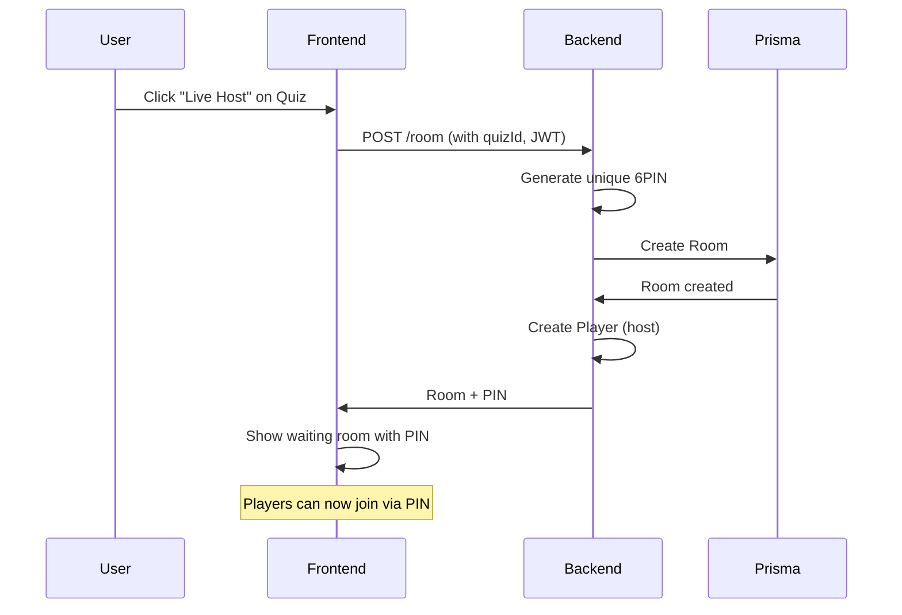
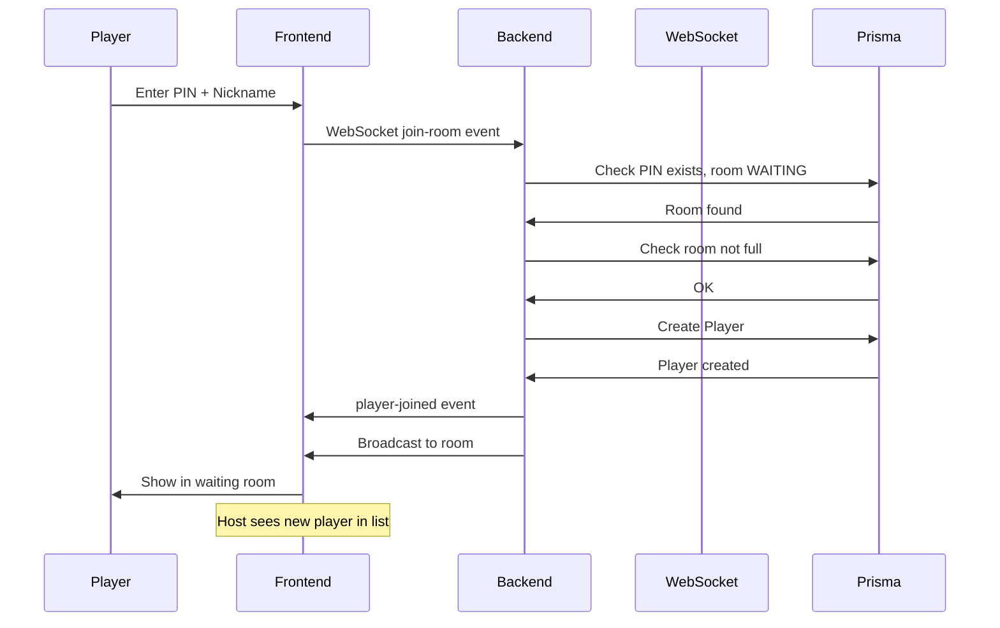
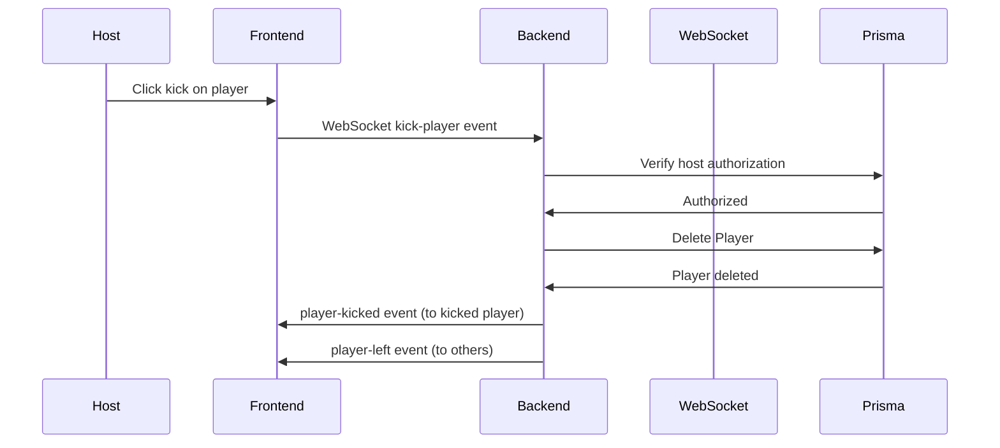
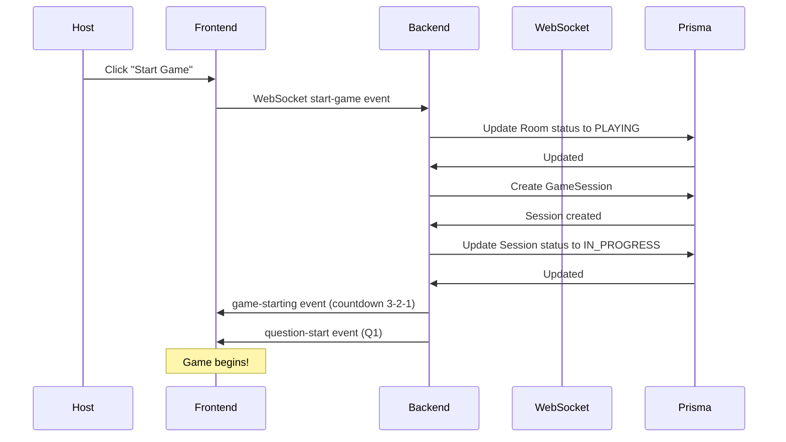

# Backend Game Documentation - Room & Game Session

**Version:** 1.0.0
**Date:** 2026-05-06
**Status:** Draft

---

## Table of Contents

1. [Overview](#1-overview)
2. [Room Entity & API](#2-room-entity--api)
3. [Game Session Entity & API](#3-game-session-entity--api)
4. [Player Entity & API](#4-player-entity--api)
5. [WebSocket Events](#5-websocket-events)
6. [API Endpoints Summary](#6-api-endpoints-summary)
7. [Flow Diagrams](#7-flow-diagrams)

---

## 1. Overview

### 1.1 Purpose
This document describes the backend architecture for Room management, Game Session creation, and Player joining without authentication.

### 1.2 Constraints
- **Do NOT modify Prisma schema** - Work with existing entities
- Player joins without login (nickname only)
- User must be authenticated to create rooms (Host)

### 1.3 Existing Entities (Prisma Schema)

```prisma
Room {
  id          String   @id @default(uuid())
  pin         String   @unique  // 6-digit PIN
  hostId      String?  // User who created this room
  quizId      String?  // Quiz selected for this room
  status      RoomStatus  // WAITING, PLAYING, FINISHED
  maxPlayers  Int      @default(50)
  createdAt   DateTime
  updatedAt   DateTime
}

Player {
  id        String   @id @default(uuid())
  roomId    String
  nickname  String
  socketId  String?  // WebSocket connection ID
  isHost    Boolean  @default(false)
  isReady   Boolean  @default(false)
  joinedAt  DateTime
}

GameSession {
  id          String   @id @default(uuid())
  roomId      String
  quizId      String
  status      SessionStatus  // CREATED, IN_PROGRESS, COMPLETED
  startedAt   DateTime?
  endedAt     DateTime?
  createdAt   DateTime
}
```

---

## 2. Room Entity & API

### 2.1 Room Service Methods

```typescript
// Room Service Methods

interface CreateRoomDto {
  quizId: string;
  hostId: string;
  maxPlayers?: number;  // default: 50
}

interface RoomResponse {
  id: string;
  pin: string;
  status: RoomStatus;
  quizId: string;
  maxPlayers: number;
  currentPlayers: number;
  players: PlayerInRoom[];
}

// Create new room with 6-digit PIN
async createRoom(dto: CreateRoomDto): Promise<RoomResponse>

// Get room by PIN (for player joining)
async getRoomByPin(pin: string): Promise<RoomResponse | null>

// Get room by ID
async getRoomById(id: string): Promise<RoomResponse | null>

// Validate PIN exists and is joinable
async validatePinForJoin(pin: string): Promise<{
  valid: boolean;
  roomId?: string;
  error?: string;
}>

// Update room status
async updateRoomStatus(roomId: string, status: RoomStatus): Promise<void>

// Delete room (only by host)
async deleteRoom(roomId: string, hostId: string): Promise<void>
```

### 2.2 PIN Generation

```typescript
// Generate unique 6-digit PIN
function generatePin(): string {
  // Generate random 6-digit number
  // Check if exists in database
  // Retry if exists (max 10 attempts)
  // Format: 000000 - 999999
}

async function generateUniquePin(): Promise<string> {
  let pin: string;
  let attempts = 0;
  do {
    pin = generatePin();
    attempts++;
  } while (await this.pinExists(pin) && attempts < 10);

  if (attempts >= 10) {
    throw new Error('Unable to generate unique PIN');
  }
  return pin;
}
```

### 2.3 Room Status Transitions

```
[WAITING] ---> [PLAYING] ---> [FINISHED]
     |              |
     v              v
  [DELETED]    [CANCELLED]
```

| Status | Description |
|--------|-------------|
| WAITING | Room created, waiting for players |
| PLAYING | Game in progress |
| FINISHED | Game completed |
| DELETED | Room deleted by host |

---

## 3. Game Session Entity & API

### 3.1 Game Session Service Methods

```typescript
// Game Session Service Methods

interface CreateGameSessionDto {
  roomId: string;
  quizId: string;
  hostId: string;  // Verify host permission
}

interface GameSessionResponse {
  id: string;
  roomId: string;
  quizId: string;
  status: SessionStatus;
  startedAt: Date | null;
  endedAt: Date | null;
  questionIndex: number;  // Current question (0-based)
  totalQuestions: number;
}

// Create new game session (triggered by Host clicking "Start")
async createGameSession(dto: CreateGameSessionDto): Promise<GameSessionResponse>

// Get game session by ID
async getGameSessionById(id: string): Promise<GameSessionResponse | null>

// Get game session by room ID
async getGameSessionByRoomId(roomId: string): Promise<GameSessionResponse | null>

// Start game session
async startGameSession(sessionId: string): Promise<GameSessionResponse>

// End game session
async endGameSession(sessionId: string): Promise<GameSessionResponse>

// Move to next question
async nextQuestion(sessionId: string): Promise<GameSessionResponse>

// Verify host is authorized for session
async verifyHostAuthorization(sessionId: string, userId: string): Promise<boolean>
```

### 3.2 Game Session Status Transitions

```
[CREATED] ---> [IN_PROGRESS] ---> [COMPLETED]
     |               |
     v               v
  [CANCELLED]   [INTERRUPTED]
```

| Status | Description |
|--------|-------------|
| CREATED | Session created, not started yet |
| IN_PROGRESS | Game running, questions being answered |
| COMPLETED | All questions answered |
| CANCELLED | Host cancelled before start |
| INTERRUPTED | Game stopped unexpectedly |

---

## 4. Player Entity & API

### 4.1 Player Service Methods

```typescript
// Player Service Methods

interface JoinRoomDto {
  roomId: string;
  nickname: string;
}

interface PlayerResponse {
  id: string;
  roomId: string;
  nickname: string;
  isHost: boolean;
  isReady: boolean;
  joinedAt: Date;
}

// Join room without authentication (Player flow)
async joinRoom(dto: JoinRoomDto): Promise<PlayerResponse>

// Leave room
async leaveRoom(playerId: string): Promise<void>

// Kick player from room (Host only)
async kickPlayer(playerId: string, hostId: string): Promise<void>

// Get all players in room
async getPlayersInRoom(roomId: string): Promise<PlayerResponse[]>

// Update player ready status
async setPlayerReady(playerId: string, isReady: boolean): Promise<PlayerResponse>

// Get player by socket ID
async getPlayerBySocketId(socketId: string): Promise<PlayerResponse | null>

// Validate player is in room
async validatePlayerInRoom(playerId: string, roomId: string): Promise<boolean>
```

### 4.2 Player Join Flow (No Auth)

```
Player enters PIN
       |
       v
  Validate PIN exists
       |
       v
  Check room status is WAITING
       |
       v
  Check room not full
       |
       v
  Create Player record (no userId)
       |
       v
  Return player info + room details
```

---

## 5. WebSocket Events

### 5.1 Socket.io Namespace Structure

```typescript
// Namespaces
'/room'     // Room management & waiting room
'/game'     // Game session & gameplay

// Each room has dedicated socket room
`/room:${roomId}`    // Player connections
`/game:${roomId}`    // Game events
```

### 5.2 Room Namespace Events

#### Client -> Server

| Event | Payload | Description |
|-------|---------|-------------|
| `join-room` | `{ pin, nickname }` | Player joins via PIN |
| `leave-room` | `{ playerId }` | Player leaves room |
| `kick-player` | `{ playerId }` | Host kicks player |
| `set-ready` | `{ playerId, isReady }` | Player toggles ready |
| `start-game` | `{ roomId }` | Host starts the game |
| `ping` | - | Heartbeat |

#### Server -> Client

| Event | Payload | Description |
|-------|---------|-------------|
| `player-joined` | `PlayerResponse` | New player joined room |
| `player-left` | `{ playerId, nickname }` | Player left room |
| `player-kicked` | `{ playerId, reason }` | Player was kicked |
| `player-updated` | `PlayerResponse` | Player status changed |
| `game-starting` | `{ sessionId, countdown }` | Game is starting |
| `error` | `{ code, message }` | Error occurred |
| `room-closed` | `{ reason }` | Room was closed |

### 5.3 Game Namespace Events

#### Client -> Server

| Event | Payload | Description |
|-------|---------|-------------|
| `submit-answer` | `{ sessionId, questionId, answerIds }` | Submit answer |
| `ping` | - | Heartbeat |

#### Server -> Client

| Event | Payload | Description |
|-------|---------|-------------|
| `question-start` | `{ index, question, timeLimit }` | New question |
| `question-end` | `{ index, correctAnswers }` | Time's up |
| `leaderboard` | `{ rankings }` | Updated scores |
| `session-end` | `{ finalRankings, winner }` | Game finished |
| `error` | `{ code, message }` | Error occurred |

### 5.4 Socket Authentication

```typescript
// Middleware for WebSocket authentication

// For Host (authenticated users)
io.of('/room').use(authenticateToken);  // JWT verification

// For Player (no auth, use nickname)
io.of('/room').use((socket, next) => {
  // Allow anonymous connections for player join
  // Validate on join-room event
  next();
});
```

---

## 6. API Endpoints Summary

### 6.1 REST Endpoints

#### Room Management

| Method | Endpoint | Auth | Description |
|--------|----------|------|-------------|
| POST | `/room` | User | Create new room (returns PIN) |
| GET | `/room/:pin` | Public | Get room by PIN |
| PATCH | `/room/:id/status` | User | Update room status |
| DELETE | `/room/:id` | Host | Delete room |

#### Game Session

| Method | Endpoint | Auth | Description |
|--------|----------|------|-------------|
| POST | `/game-session` | User | Create and start game session |
| GET | `/game-session/:id` | Public | Get session details |
| PATCH | `/game-session/:id/start` | Host | Start the game |
| PATCH | `/game-session/:id/end` | Host | End the game |
| GET | `/game-session/room/:roomId` | Public | Get session by room |

#### Player (for Host to manage)

| Method | Endpoint | Auth | Description |
|--------|----------|------|-------------|
| GET | `/room/:id/players` | Public | Get all players in room |
| DELETE | `/room/:id/players/:playerId` | Host | Kick player |

### 6.2 Request/Response Examples

#### Create Room

**Request:**
```http
POST /room
Authorization: Bearer <jwt_token>
Content-Type: application/json

{
  "quizId": "uuid-of-quiz",
  "maxPlayers": 50
}
```

**Response:**
```json
{
  "id": "room-uuid",
  "pin": "123456",
  "status": "WAITING",
  "quizId": "uuid-of-quiz",
  "maxPlayers": 50,
  "currentPlayers": 1,
  "players": [
    {
      "id": "host-player-id",
      "nickname": "Host Nickname",
      "isHost": true,
      "isReady": true,
      "joinedAt": "2026-05-06T10:00:00Z"
    }
  ]
}
```

#### Join Room (Player)

**WebSocket Event:**
```json
// Client sends
{
  "event": "join-room",
  "data": {
    "pin": "123456",
    "nickname": "JohnPlayer"
  }
}

// Server responds
{
  "event": "player-joined",
  "data": {
    "id": "player-uuid",
    "roomId": "room-uuid",
    "nickname": "JohnPlayer",
    "isHost": false,
    "isReady": false,
    "joinedAt": "2026-05-06T10:05:00Z"
  }
}
```

#### Start Game

**WebSocket Event:**
```json
// Client (Host) sends
{
  "event": "start-game",
  "data": {
    "roomId": "room-uuid"
  }
}

// Server broadcasts to all
{
  "event": "game-starting",
  "data": {
    "sessionId": "session-uuid",
    "countdown": 3,
    "totalQuestions": 10
  }
}
```

---

## 7. Flow Diagrams

### 7.1 Room Creation Flow (Host)



### 7.2 Player Join Flow



### 7.3 Kick Player Flow



### 7.4 Start Game Flow



---

## 8. Error Handling

### 8.1 Error Codes

| Code | Message | Description |
|------|---------|-------------|
| ROOM_NOT_FOUND | Room not found | PIN does not exist |
| ROOM_FULL | Room is full | Max players reached |
| ROOM_NOT_WAITING | Room not accepting players | Game already started |
| ROOM_FINISHED | Game has ended | Room status is FINISHED |
| UNAUTHORIZED | Not authorized | User not host of room |
| INVALID_NICKNAME | Invalid nickname | Nickname too short/long |
| SESSION_EXISTS | Game already in progress | Cannot start twice |

### 8.2 Error Response Format

```typescript
interface ErrorResponse {
  code: string;
  message: string;
  details?: Record<string, any>;
}

// Example
{
  "code": "ROOM_NOT_FOUND",
  "message": "No room found with this PIN",
  "details": {
    "pin": "123456"
  }
}
```

---

## 9. Security Considerations

### 9.1 PIN Security
- PINs are randomly generated, not sequential
- Rate limiting on PIN validation (5 attempts/minute/IP)
- PIN expires after 24 hours

### 9.2 Host Authorization
- Only room creator can perform host actions
- JWT token required for room creation
- Host status verified on every action

### 9.3 Player Validation
- Nickname validation (2-20 characters, no profanity)
- Session timeout (disconnect after 5 minutes idle)
- Max nickname uniqueness per room

---

*Document generated: 2026-05-06*
