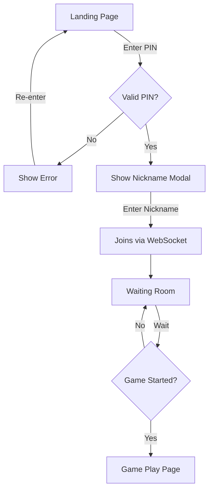
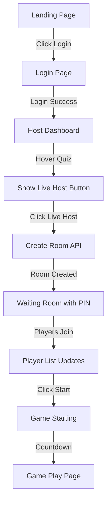
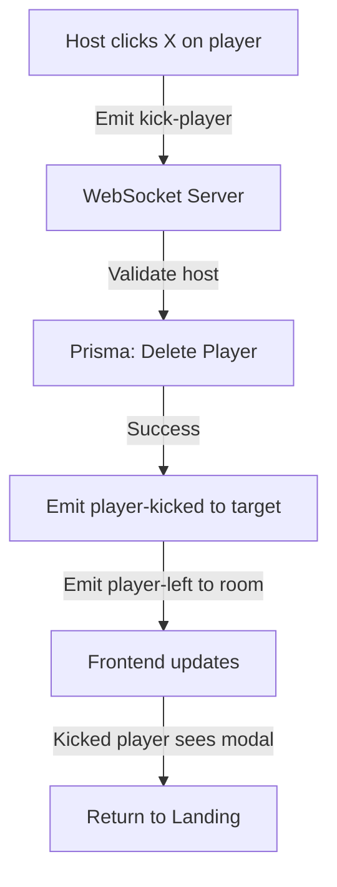
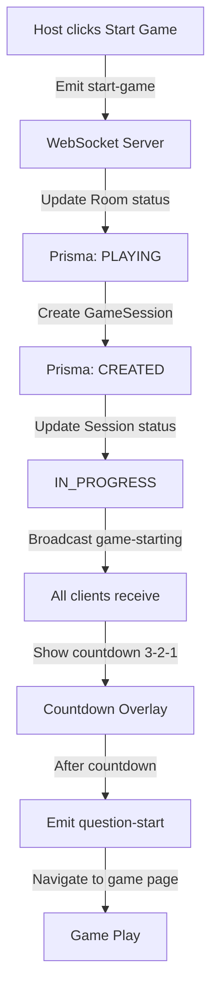

# Frontend Game Documentation - Room & Game Session

**Version:** 1.0.0
**Date:** 2026-05-06
**Status:** Draft

---

## Table of Contents

1. [Overview](#1-overview)
2. [Page Structure](#2-page-structure)
3. [Components](#3-components)
4. [Pages](#4-pages)
5. [User Flows](#5-user-flows)
6. [State Management](#6-state-management)
7. [API Integration](#7-api-integration)
8. [WebSocket Integration](#8-websocket-integration)
9. [UI/UX Guidelines](#9-uiux-guidelines)

---

## 1. Overview

### 1.1 Purpose
This document describes the frontend architecture for Room management, Game Session creation, and Player joining flows.

### 1.2 Landing Page Flow

```
[Landing Page]
     |
     +---> Enter PIN + Enter ---> [Waiting Room] (Player)
     |
     +---> Click Login ---> [Login Page] ---> [Host Dashboard] ---> [Waiting Room] (Host)
```

### 1.3 Key Pages

| Page | Path | Auth | Description |
|------|------|------|-------------|
| Landing | `/` | Public | PIN entry + Login button |
| Login | `/login` | Public | User authentication |
| Host Dashboard | `/host` | User | List quizzes with Live Host/Edit |
| Waiting Room | `/room/:pin` | Public | Room waiting room (Host or Player) |
| Game Play | `/play/:sessionId` | Public | Active game session |

---

## 2. Page Structure

### 2.1 Landing Page (`/`)

```
+------------------------------------------+
|                                          |
|            [Logo/Brand]                  |
|                                          |
|        +------------------------+        |
|        | Enter Room Code        |        |
|        +------------------------+        |
|        | PIN: [      ]          |        |
|        |                        |        |
|        | [Join Room]            |        |
|        +------------------------+        |
|                                          |
|           OR                              |
|                                          |
|        [Login to Host]                   |
|                                          |
+------------------------------------------+
```

### 2.2 Host Dashboard (`/host`)

```
+------------------------------------------+
|  Logo   |  Host Dashboard  | [Logout]   |
+---------+------------------+------------+
|                                         |
|  My Quizzes                             |
|  +----------------------------------+   |
|  | Quiz 1                    | Live |   |
|  | Description...            | Edit |   |
|  +----------------------------------+   |
|  | Quiz 2                    | Live |   |
|  | Description...            | Edit |   |
|  +----------------------------------+   |
|  | Quiz 3                    | Live |   |
|  | Description...            | Edit |   |
|  +----------------------------------+   |
|                                         |
|  +----------------------------------+   |
|  | + Create New Quiz                |   |
|  +----------------------------------+   |
|                                         |
+------------------------------------------+
```

**Hover State on Quiz Card:**

```
+------------------------------------------+
| Quiz Title                               |
| Description...                           |
|                                          |
| [Live Host]  [Edit]  [Delete]           |
+------------------------------------------+
     ^ Popup on hover
```

### 2.3 Waiting Room (`/room/:pin`)

**Host View:**

```
+------------------------------------------+
|  Room PIN: 123456          [Share PIN]  |
+---------+------------------+------------+
|                                         |
|  Waiting Room                           |
|  Players (3/50)                          |
|  +----------------------------------+   |
|  | Host Nick  | Host | Ready | [X] |   |
|  +----------------------------------+   |
|  | Player1    |      |  Γ£ô    | [X] |   |
|  +----------------------------------+   |
|  | Player2    |      |  Γ£ô    | [X] |   |
|  +----------------------------------+   |
|                                         |
|  Quiz: Quiz Title                       |
|  Questions: 10                          |
|                                         |
|  [Start Game]                           |
|  (enabled when 1+ players)              |
|                                         |
+------------------------------------------+
```

**Player View:**

```
+------------------------------------------+
|  Room PIN: 123456                       |
+---------+------------------+------------+
|                                         |
|  Waiting Room                           |
|  Players (3/50)                         |
|  +----------------------------------+   |
|  | Host Nick  | Host | Ready |      |   |
|  +----------------------------------+   |
|  | YourNick   |      |  Γ£ô    |      |   |
|  +----------------------------------+   |
|  | Player2    |      |       |      |   |
|  +----------------------------------+   |
|                                         |
|  Quiz: Quiz Title                       |
|  Questions: 10                          |
|                                         |
|  [Ready / Not Ready]                    |
|  Waiting for host to start...           |
|                                         |
+------------------------------------------+
```

---

## 3. Components

### 3.1 Component Structure

```
frontend/components/game/
Γö£ΓöÇΓöÇ PinInput.tsx           # PIN entry input
Γö£ΓöÇΓöÇ QuizCard.tsx            # Quiz card with hover actions
Γö£ΓöÇΓöÇ PlayerList.tsx          # List of players in room
Γö£ΓöÇΓöÇ PlayerItem.tsx          # Single player row
Γö£ΓöÇΓöÇ WaitingRoom.tsx         # Waiting room container
Γö£ΓöÇΓöÇ GameLobby.tsx           # Main lobby component
Γö£ΓöÇΓöÇ CountdownOverlay.tsx    # 3-2-1 countdown
Γö£ΓöÇΓöÇ QuestionDisplay.tsx     # Question presentation
Γö£ΓöÇΓöÇ AnswerOptions.tsx      # Answer buttons
Γö£ΓöÇΓöÇ Leaderboard.tsx        # Score display
ΓööΓöÇΓöÇ GameResults.tsx        # Final results
```

### 3.2 Component Details

#### PinInput.tsx

```typescript
interface PinInputProps {
  value: string;
  onChange: (value: string) => void;
  onSubmit: () => void;
  error?: string;
  disabled?: boolean;
}

// Features:
// - 6 digit input
// - Auto-focus next digit
// - Auto-submit on 6 digits
// - Backspace navigation
// - Error message display
```

#### QuizCard.tsx

```typescript
interface QuizCardProps {
  quiz: Quiz;
  onHover?: () => void;       // Show action buttons
  onLiveHost?: () => void;    // Create room + start waiting
  onEdit?: () => void;        // Navigate to quiz editor
  onDelete?: () => void;      // Delete quiz
}

// Features:
// - Display quiz title, description, question count
// - Hover reveal action buttons
// - Loading states for actions
```

#### PlayerList.tsx

```typescript
interface PlayerListProps {
  players: Player[];
  currentPlayerId?: string;
  isHost: boolean;
  onKick?: (playerId: string) => void;
  onReady?: () => void;
}

// Features:
// - List all players
// - Show host badge
// - Show ready status
// - Host can kick players
// - Player can toggle ready
```

#### WaitingRoom.tsx

```typescript
interface WaitingRoomProps {
  room: RoomInfo;
  players: Player[];
  isHost: boolean;
  currentPlayerId: string;
  onStartGame?: () => void;
  onLeaveRoom?: () => void;
  onKickPlayer?: (playerId: string) => void;
  onToggleReady?: () => void;
}

// Features:
// - Display room PIN (copyable)
// - Show player list
// - Start game button (host only)
// - Ready toggle (player only)
// - Leave room option
```

---

## 4. Pages

### 4.1 Landing Page (`/`)

```typescript
// app/page.tsx (or app/(public)/page.tsx)

export default function LandingPage() {
  const [pin, setPin] = useState('');
  const [error, setError] = useState('');

  const handlePinSubmit = async () => {
    // Validate PIN
    // Join room via WebSocket
    // Navigate to /room/:pin
  };

  const handleLoginClick = () => {
    // Navigate to /login
  };

  return (
    <div className="landing-container">
      <h1>Quiz Game</h1>

      <div className="pin-section">
        <h2>Enter Room Code</h2>
        <PinInput
          value={pin}
          onChange={setPin}
          onSubmit={handlePinSubmit}
          error={error}
        />
        <Button onClick={handlePinSubmit}>Join Room</Button>
      </div>

      <div className="divider">
        <span>OR</span>
      </div>

      <Button onClick={handleLoginClick}>
        Login to Host a Game
      </Button>
    </div>
  );
}
```

### 4.2 Host Dashboard (`/host`)

```typescript
// app/(authenticated)/host/page.tsx

export default function HostDashboardPage() {
  const [quizzes, setQuizzes] = useState<Quiz[]>([]);
  const [hoveredQuiz, setHoveredQuiz] = useState<string | null>(null);
  const router = useRouter();

  useEffect(() => {
    // Fetch user's quizzes
    fetchMyQuizzes();
  }, []);

  const handleLiveHost = async (quizId: string) => {
    // Create room via API
    const room = await roomService.createRoom({ quizId });

    // Navigate to waiting room
    router.push(`/room/${room.pin}`);
  };

  const handleEdit = (quizId: string) => {
    router.push(`/quiz/edit/${quizId}`);
  };

  return (
    <div className="host-dashboard">
      <Header title="Host Dashboard" />

      <div className="quiz-list">
        {quizzes.map(quiz => (
          <div
            key={quiz.id}
            onMouseEnter={() => setHoveredQuiz(quiz.id)}
            onMouseLeave={() => setHoveredQuiz(null)}
          >
            <QuizCard
              quiz={quiz}
              onLiveHost={() => handleLiveHost(quiz.id)}
              onEdit={() => handleEdit(quiz.id)}
            />

            {hoveredQuiz === quiz.id && (
              <div className="hover-actions">
                <Button onClick={() => handleLiveHost(quiz.id)}>
                  Live Host
                </Button>
                <Button variant="secondary" onClick={() => handleEdit(quiz.id)}>
                  Edit
                </Button>
              </div>
            )}
          </div>
        ))}
      </div>
    </div>
  );
}
```

### 4.3 Waiting Room (`/room/:pin`)

```typescript
// app/(game)/room/[pin]/page.tsx

export default function WaitingRoomPage() {
  const params = useParams();
  const pin = params.pin as string;

  const [room, setRoom] = useState<RoomInfo | null>(null);
  const [players, setPlayers] = useState<Player[]>([]);
  const [currentPlayer, setCurrentPlayer] = useState<Player | null>(null);
  const [isReady, setIsReady] = useState(false);
  const { socket, isConnected } = useSocket();

  const isHost = currentPlayer?.isHost ?? false;

  useEffect(() => {
    // Connect to WebSocket room
    connectToRoom(pin);

    // Listen for events
    socket.on('player-joined', handlePlayerJoined);
    socket.on('player-left', handlePlayerLeft);
    socket.on('player-kicked', handlePlayerKicked);
    socket.on('game-starting', handleGameStarting);

    return () => {
      socket.off('player-joined');
      socket.off('player-left');
      socket.off('player-kicked');
      socket.off('game-starting');
      disconnectFromRoom();
    };
  }, [pin]);

  const handleJoinAsPlayer = (nickname: string) => {
    socket.emit('join-room', { pin, nickname });
  };

  const handleJoinAsHost = () => {
    // Already authenticated, join as host
    socket.emit('join-room-as-host', { pin });
  };

  const handleStartGame = () => {
    socket.emit('start-game', { roomId: room.id });
  };

  const handleKickPlayer = (playerId: string) => {
    socket.emit('kick-player', { playerId });
  };

  const handleToggleReady = () => {
    socket.emit('set-ready', { isReady: !isReady });
    setIsReady(!isReady);
  };

  if (!currentPlayer) {
    // Show nickname entry form
    return <NicknameEntry onSubmit={handleJoinAsPlayer} />;
  }

  return (
    <WaitingRoom
      room={room}
      players={players}
      isHost={isHost}
      currentPlayerId={currentPlayer.id}
      onStartGame={handleStartGame}
      onKickPlayer={handleKickPlayer}
      onToggleReady={handleToggleReady}
    />
  );
}
```

### 4.4 Nickname Entry Modal

```typescript
// components/game/NicknameEntry.tsx

export default function NicknameEntry({
  onSubmit,
  isLoading,
}: NicknameEntryProps) {
  const [nickname, setNickname] = useState('');

  const handleSubmit = (e: FormEvent) => {
    e.preventDefault();
    if (nickname.length >= 2 && nickname.length <= 20) {
      onSubmit(nickname);
    }
  };

  return (
    <div className="nickname-modal">
      <div className="modal-content">
        <h2>Enter Your Nickname</h2>
        <form onSubmit={handleSubmit}>
          <Input
            value={nickname}
            onChange={(e) => setNickname(e.target.value)}
            placeholder="Your nickname (2-20 chars)"
            maxLength={20}
            autoFocus
          />
          <Button
            type="submit"
            disabled={nickname.length < 2 || isLoading}
          >
            {isLoading ? 'Joining...' : 'Join Room'}
          </Button>
        </form>
      </div>
    </div>
  );
}
```

---

## 5. User Flows

### 5.1 Player Join Flow



### 5.2 Host Flow



### 5.3 Kick Player Flow



### 5.4 Start Game Flow



---

## 6. State Management

### 6.1 Zustand Store

```typescript
// stores/gameStore.ts

interface GameState {
  // Room state
  room: RoomInfo | null;
  pin: string;

  // Player state
  currentPlayer: Player | null;
  players: Player[];

  // Game session state
  session: GameSession | null;
  currentQuestion: number;

  // UI state
  isHost: boolean;
  isConnected: boolean;

  // Actions
  setRoom: (room: RoomInfo) => void;
  setCurrentPlayer: (player: Player) => void;
  addPlayer: (player: Player) => void;
  removePlayer: (playerId: string) => void;
  updatePlayer: (player: Player) => void;
  startGame: (session: GameSession) => void;
  reset: () => void;
}

export const useGameStore = create<GameState>((set) => ({
  room: null,
  pin: '',
  currentPlayer: null,
  players: [],
  session: null,
  currentQuestion: 0,
  isHost: false,
  isConnected: false,

  setRoom: (room) => set({ room }),
  setCurrentPlayer: (player) => set({ currentPlayer: player }),
  addPlayer: (player) => set((state) => ({
    players: [...state.players, player]
  })),
  removePlayer: (playerId) => set((state) => ({
    players: state.players.filter(p => p.id !== playerId)
  })),
  updatePlayer: (player) => set((state) => ({
    players: state.players.map(p => p.id === player.id ? player : p)
  })),
  startGame: (session) => set({ session, currentQuestion: 0 }),
  reset: () => set({
    room: null,
    pin: '',
    currentPlayer: null,
    players: [],
    session: null,
    currentQuestion: 0,
    isHost: false,
  }),
}));
```

### 6.2 WebSocket Hook

```typescript
// hooks/useGameSocket.ts

export function useGameSocket(pin: string, options: {
  onPlayerJoined?: (player: Player) => void;
  onPlayerLeft?: (data: { playerId: string }) => void;
  onPlayerKicked?: (data: { playerId: string }) => void;
  onGameStarting?: (data: GameStartingData) => void;
}) {
  const [socket, setSocket] = useState<Socket | null>(null);
  const [isConnected, setIsConnected] = useState(false);

  useEffect(() => {
    const newSocket = io('/room');

    newSocket.on('connect', () => {
      setIsConnected(true);
      newSocket.emit('join-room', { pin });
    });

    newSocket.on('disconnect', () => {
      setIsConnected(false);
    });

    // Register event handlers
    newSocket.on('player-joined', options.onPlayerJoined);
    newSocket.on('player-left', options.onPlayerLeft);
    newSocket.on('player-kicked', options.onPlayerKicked);
    newSocket.on('game-starting', options.onGameStarting);

    setSocket(newSocket);

    return () => {
      newSocket.disconnect();
    };
  }, [pin]);

  return { socket, isConnected };
}
```

---

## 7. API Integration

### 7.1 Room Service

```typescript
// services/room.service.ts

import { apiClient } from './apiClient';
import type { Room, CreateRoomDto } from '@/types';

export const roomService = {
  async createRoom(dto: CreateRoomDto): Promise<Room> {
    return apiClient.post<Room>('/room', dto);
  },

  async getRoomByPin(pin: string): Promise<Room> {
    return apiClient.get<Room>(`/room/pin/${pin}`);
  },

  async getRoomById(id: string): Promise<Room> {
    return apiClient.get<Room>(`/room/${id}`);
  },

  async deleteRoom(id: string): Promise<void> {
    return apiClient.delete(`/room/${id}`);
  },
};
```

### 7.2 Quiz Service

```typescript
// services/quiz.service.ts

import { apiClient } from './apiClient';
import type { Quiz } from '@/types';

export const quizService = {
  async getMyQuizzes(): Promise<Quiz[]> {
    return apiClient.get<Quiz[]>('/quiz/my');
  },

  async getQuizById(id: string): Promise<Quiz> {
    return apiClient.get<Quiz>(`/quiz/${id}`);
  },
};
```

---

## 8. WebSocket Integration

### 8.1 Socket.io Client Setup

```typescript
// lib/socket.ts

import { io, Socket } from 'socket.io-client';

let socket: Socket | null = null;

export function getSocket(): Socket {
  if (!socket) {
    socket = io(process.env.NEXT_PUBLIC_WS_URL || 'http://localhost:3001', {
      path: '/socket.io',
      transports: ['websocket', 'polling'],
      autoConnect: true,
    });
  }
  return socket;
}

export function disconnectSocket(): void {
  if (socket) {
    socket.disconnect();
    socket = null;
  }
}
```

### 8.2 Event Handlers

```typescript
// hooks/useRoomEvents.ts

export function useRoomEvents(roomPin: string) {
  const { addPlayer, removePlayer, setRoom, startGame } = useGameStore();

  const socket = getSocket();

  useEffect(() => {
    // Join room
    socket.emit('join-room', { pin: roomPin });

    // Event listeners
    socket.on('room-info', (room: Room) => {
      setRoom(room);
    });

    socket.on('player-joined', (player: Player) => {
      addPlayer(player);
    });

    socket.on('player-left', ({ playerId }: { playerId: string }) => {
      removePlayer(playerId);
    });

    socket.on('game-starting', ({ sessionId, countdown }: GameStartingData) => {
      // Navigate to game page
      router.push(`/play/${sessionId}`);
    });

    socket.on('player-kicked', ({ playerId }: { playerId: string }) => {
      // Show kicked modal
      alert('You have been removed from the room');
      router.push('/');
    });

    socket.on('room-closed', ({ reason }: { reason: string }) => {
      alert(`Room closed: ${reason}`);
      router.push('/');
    });

    return () => {
      socket.off('room-info');
      socket.off('player-joined');
      socket.off('player-left');
      socket.off('game-starting');
      socket.off('player-kicked');
      socket.off('room-closed');
      socket.emit('leave-room', { pin: roomPin });
    };
  }, [roomPin]);
}
```

---

## 9. UI/UX Guidelines

### 9.1 Responsive Design

| Breakpoint | Layout |
|------------|--------|
| Mobile (< 640px) | Single column, stacked elements |
| Tablet (640-1024px) | 2-column player grid |
| Desktop (> 1024px) | 3-column player grid |

### 9.2 Animation Guidelines

| Animation | Duration | Easing |
|-----------|----------|--------|
| Page transition | 300ms | ease-in-out |
| Player join/leave | 200ms | ease-out |
| Button hover | 150ms | ease |
| Countdown tick | 1000ms | linear |
| Leaderboard update | 400ms | ease-out |

### 9.3 Color Scheme

```css
:root {
  /* Primary */
  --primary: #3b82f6;
  --primary-hover: #2563eb;

  /* Status */
  --success: #22c55e;
  --warning: #f59e0b;
  --error: #ef4444;

  /* Neutral */
  --background: #ffffff;
  --foreground: #1f2937;
  --muted: #9ca3af;
  --border: #e5e7eb;

  /* Player Colors (for avatars) */
  --player-1: #f59e0b;
  --player-2: #3b82f6;
  --player-3: #22c55e;
  --player-4: #ec4899;
  --player-5: #8b5cf6;
  --player-6: #06b6d4;
}
```

### 9.4 Accessibility

- All interactive elements keyboard accessible
- Focus states visible
- ARIA labels on buttons
- Error messages announced to screen readers
- Sufficient color contrast (WCAG AA)

---

## 10. File Structure

```
frontend/
Γö£ΓöÇΓöÇ app/
Γöé   Γö£ΓöÇΓöÇ page.tsx                      # Landing page
Γöé   Γö£ΓöÇΓöÇ login/
Γöé   Γöé   ΓööΓöÇΓöÇ page.tsx                  # Login page
Γöé   Γö£ΓöÇΓöÇ host/
Γöé   Γöé   ΓööΓöÇΓöÇ page.tsx                  # Host dashboard
Γöé   Γö£ΓöÇΓöÇ room/
Γöé   Γöé   ΓööΓöÇΓöÇ [pin]/
Γöé   Γöé       ΓööΓöÇΓöÇ page.tsx              # Waiting room
Γöé   ΓööΓöÇΓöÇ play/
Γöé       ΓööΓöÇΓöÇ [sessionId]/
Γöé           ΓööΓöÇΓöÇ page.tsx              # Game play
Γö£ΓöÇΓöÇ components/
Γöé   ΓööΓöÇΓöÇ game/
Γöé       Γö£ΓöÇΓöÇ PinInput.tsx
Γöé       Γö£ΓöÇΓöÇ QuizCard.tsx
Γöé       Γö£ΓöÇΓöÇ PlayerList.tsx
Γöé       Γö£ΓöÇΓöÇ PlayerItem.tsx
Γöé       Γö£ΓöÇΓöÇ WaitingRoom.tsx
Γöé       Γö£ΓöÇΓöÇ NicknameEntry.tsx
Γöé       Γö£ΓöÇΓöÇ CountdownOverlay.tsx
Γöé       Γö£ΓöÇΓöÇ QuestionDisplay.tsx
Γöé       Γö£ΓöÇΓöÇ AnswerOptions.tsx
Γöé       Γö£ΓöÇΓöÇ Leaderboard.tsx
Γöé       ΓööΓöÇΓöÇ GameResults.tsx
Γö£ΓöÇΓöÇ hooks/
Γöé   Γö£ΓöÇΓöÇ useGameSocket.ts
Γöé   ΓööΓöÇΓöÇ useRoomEvents.ts
Γö£ΓöÇΓöÇ services/
Γöé   Γö£ΓöÇΓöÇ room.service.ts
Γöé   ΓööΓöÇΓöÇ quiz.service.ts
Γö£ΓöÇΓöÇ stores/
Γöé   ΓööΓöÇΓöÇ gameStore.ts
ΓööΓöÇΓöÇ types/
    ΓööΓöÇΓöÇ game.ts
```

---

## 11. Dependencies

### Required Packages

```json
{
  "dependencies": {
    "socket.io-client": "^4.6.0",
    "zustand": "^4.4.0"
  }
}
```

---

*Document generated: 2026-05-06*
