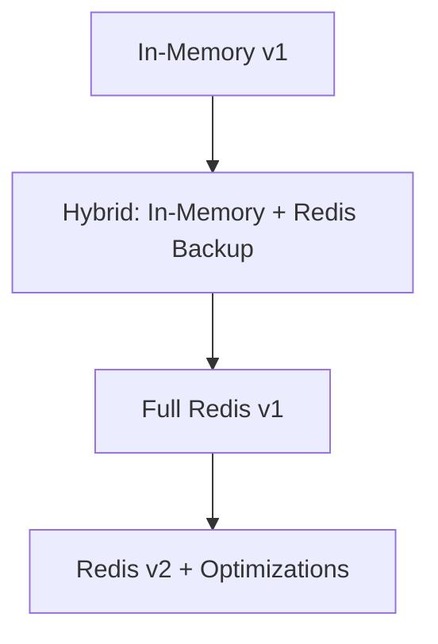

# Phân tích: Chiến lược State Management - In-Memory vs Redis

## 1. Cấu trúc Hiện tại (In-Memory)

### 1.1 Cấu trúc Dữ liệu

```typescript
// room.handler.ts
private socketInfoMap = new Map<string, RoomSocketInfo>();
private playerToSocket = new Map<string, string>();
```

```typescript
// socket-state.service.ts (trùng lặp)
private socketInfoMap = new Map<string, SocketInfo>();
private playerSocketMap = new Map<string, string>();
private roomHostMap = new Map<string, string>();
```

### 1.2 Ưu điểm
- **Tốc độ**: Truy cập O(1) trong bộ nhớ, không có network latency
- **Đơn giản**: Dễ debug, dễ hiểu
- **Không phụ thuộc**: Không cần cài đặt Redis hay any infrastructure khác
- **Chi phí thấp**: Không tốn thêm tài nguyên server

### 1.3 Nhược điểm
- **Không scale được**: Nếu chạy multiple server instances, mỗi instance có state riêng
- **Mất dữ liệu khi restart**: In-memory data bị mất khi server restart
- **Khó recover**: Khi server crash, không có cách restore connection state
- **Memory leak**: Socket objects giữ reference, có thể gây leak nếu không cleanup đúng

---

## 2. Chiến lược Đề xuất (Redis)

### 2.1 Cấu trúc Redis Keys

| Key Pattern | Type | Purpose |
|-------------|------|---------|
| `room:{pin}` | Hash | Thông tin phòng: hostSocketId, status, createdAt |
| `room:{pin}:players` | Hash | Danh sách players: key=socketId, value=JSON player info |
| `socket:{socketId}` | String | Mapping ngược: value={pin} |

### 2.2 Ưu điểm
- **Horizontal Scaling**: Nhiều WebSocket servers có thể share state
- **Fault Tolerance**: State tồn tại qua server restarts
- **Consistency**: Tất cả servers nhìn thấy cùng trạng thái
- **Better Disconnect Handling**: Có thể query socket:{socketId} để biết player đang ở phòng nào

### 2.3 Nhược điểm
- **Latency**: Redis operations thêm network hop (~1-5ms)
- **Complexity**: Cần xử lý Redis connection, error handling phức tạp hơn
- **Infrastructure**: Cần deploy và maintain Redis server
- **Overhead cho small scale**: Overkill cho single-instance deployment

---

## 3. So sánh Chi tiết

### 3.1 Join Flow

| Aspect | In-Memory | Redis |
|--------|-----------|-------|
| Join time | ~2-5ms | ~5-15ms |
| Code complexity | Simple | Moderate |
| Error handling | Simple Map ops | Try-catch Redis errors |
| Rollback | Tự động nếu throw | Cần explicit transaction |

### 3.2 Kick Flow

| Aspect | In-Memory | Redis |
|--------|-----------|-------|
| Kick time | ~2-5ms | ~5-15ms |
| Kicked player notification | Direct via socketId lookup | Via `socket:{socketId}` mapping |
| State sync | Không cần (single process) | Tự động sync |

### 3.3 Disconnect Flow (Critical)

**In-Memory:**
```typescript
handleDisconnect(client: Socket) {
  const info = this.socketInfoMap.get(client.id);
  // OK vì client object còn reference
}
```

**Redis:**
```typescript
handleDisconnect(client: Socket) {
  const pin = await redis.get(`socket:${client.id}`);
  // OK vì lấy từ Redis
  // Cần handle case client không có trong Redis (đã cleanup rồi)
}
```

**Nhận xét**: Redis handle disconnect **tốt hơn** vì:
- Có thể query bất kỳ socketId nào để tìm phòng
- Không phụ thuộc vào việc có lưu info trong memory không

---

## 4. Khi nào Nên/Chuyển sang Redis?

### Nên dùng In-Memory (hiện tại):
- Single server instance
- < 1000 concurrent connections
- Không cần high availability
- Team nhỏ, muốn iterate nhanh

### Nên chuyển sang Redis khi:
- Cần chạy multiple instances (Kubernetes replicas)
- > 1000 concurrent users
- Cần zero-downtime deployments
- Cần horizontal scaling tự động
- Muốn better fault tolerance

---

## 5. Khuyến nghị

### Ngắn hạn (Hiện tại):
**Giữ In-Memory** với các cải tiến:
1. Xóa `socket-state.service.ts` trùng lặp
2. Thêm error handling tốt hơn cho disconnect
3. Backup state vào Redis **chỉ để recover**, không phải source of truth

### Trung/Dài hạn:
**Chuyển sang Redis** khi:
1. Team đã stabilize feature set
2. Cần scale production
3. Đã có Redis infrastructure (Redis Cloud, ElastiCache, etc.)

### Migration Path (nếu cần):


---

## 6. Kết luận

| Criteria | Winner |
|----------|--------|
| Development Speed | In-Memory |
| Performance | In-Memory |
| Scalability | Redis |
| Reliability | Redis |
| Simplicity | In-Memory |
| Cost | In-Memory |

**Đề xuất**: Giữ In-Memory cho development/testing. Chỉ migrate sang Redis khi có evidence cần scale hoặc khi production cần high availability.

---

*Document created: 2026-05-08*
*Author: AI Analysis*
