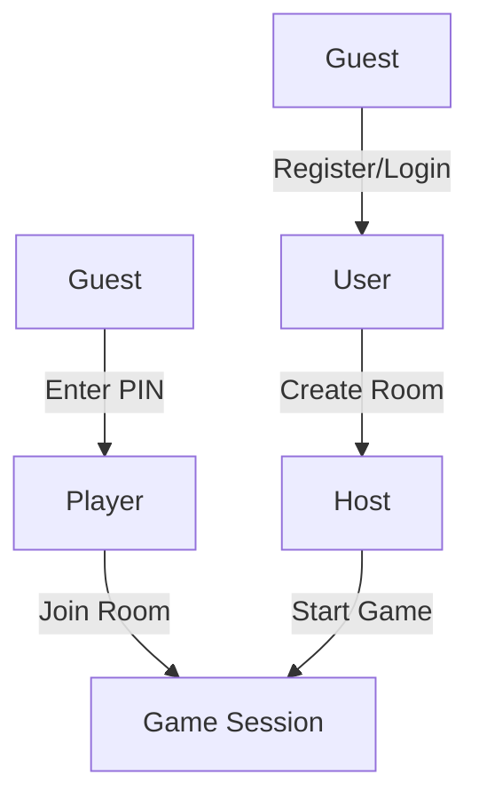

# User Story Document - Quiz Project

**Project:** Quiz Multiplayer Application
**Version:** 1.1.0
**Date:** 2026-05-06
**Status:** Draft

---

## Table of Contents

1. [Document Overview](#1-document-overview)
2. [Actors](#2-actors)
3. [Epic 1: Authentication](#3-epic-1-authentication)
4. [Epic 2: Quiz Management](#4-epic-2-quiz-management-admin)
5. [Epic 3: Room & Game Play](#5-epic-3-room--game-play)
6. [Epic 4: User Management](#6-epic-4-user-management-admin)
7. [Epic 5: Admin Dashboard](#7-epic-5-admin-dashboard)
8. [Epic 6: System Features](#8-epic-6-system-features)
9. [User Story Index](#9-user-story-index)
10. [Appendix](#10-appendix)

---

## 1. Document Overview

### 1.1 Purpose
This document defines all user stories for the Quiz Multiplayer Application, covering features from user authentication to real-time gameplay and admin management.

### 1.2 Scope
- User authentication and authorization
- Player (guest) join via PIN without login
- Quiz creation and management
- Real-time multiplayer game rooms
- Admin dashboard and system management
- Notifications and reporting system

### 1.3 Definitions

| Term | Description |
|------|-------------|
| User | Authenticated account holder who can create rooms |
| Player | Guest who joins a room by PIN without login |
| Host | User who creates and controls a game room |
| Guest | Unauthenticated user browsing the system |
| Quiz | A collection of questions for players to answer |
| Room | A virtual space where players join to play together |
| PIN | 6-digit code used to join a room |
| Session | Active game instance within a room |

---

## 2. Actors

### 2.1 Actor Definitions

| Actor | Description | Access Level |
|-------|-------------|--------------|
| **Guest** | Unauthenticated user browsing the system | Public pages only (login, register) |
| **User** | Authenticated user with account who can create rooms | Authenticated + Room creation |
| **Player** | Guest who joins a room by PIN without login | No authentication required |
| **Host** | User who creates and controls a game room | User + Room control |
| **Admin** | System administrator with full access | Full system access |

### 2.2 Actor Hierarchy

```
Admin
  └── User (authenticated)
        ├── Can create rooms (becomes Host)
        └── Guest (unauthenticated)
              └── Player (joins via PIN, no account needed)
```

### 2.3 Actor Workflow



### 2.4 Key Differences: User vs Player

| Aspect | User | Player |
|--------|------|--------|
| Authentication | Required (email + password) | Not required |
| Identity | Persistent account | Temporary nickname per session |
| Create Room | Yes | No |
| Join Room | Yes (via PIN or link) | Yes (via PIN) |
| View History | Yes | No |
| Build Profile | Yes | No |

---

## 3. Epic 1: Authentication

### US-001: User Registration

**Story ID:** US-001
**Title:** As a Guest, I want to register a new account so that I can access the system.

**Actors:** Guest

**Description:**
A new user should be able to create an account with email and password to access the quiz platform.

**Acceptance Criteria:**
- [ ] User can fill registration form with email, password, and confirm password
- [ ] Email must be valid format and unique in the system
- [ ] Password must meet minimum security requirements (min 8 characters)
- [ ] Password and confirm password must match
- [ ] On success, user receives confirmation and is logged in automatically
- [ ] On failure, appropriate error messages are displayed

**Priority:** Must Have (P0)
**Technical Notes:** API endpoint `/auth/register`, password hashed with bcrypt.

---

### US-002: User Login

**Story ID:** US-002
**Title:** As a Guest, I want to log in so that I can access my account and play quizzes.

**Actors:** Guest

**Description:**
Existing users should be able to log in with email and password to access their account.

**Acceptance Criteria:**
- [ ] User can enter email and password
- [ ] System validates credentials
- [ ] On success, user receives JWT token and is redirected to home page
- [ ] On failure (wrong credentials), error message is displayed
- [ ] Remember login state across sessions (using refresh token)
- [ ] Support login with Google OAuth button

**Priority:** Must Have (P0)
**Technical Notes:** API endpoint `/auth/login`, JWT access token + httpOnly refresh token cookie.

---

### US-003: User Logout

**Story ID:** US-003
**Title:** As a Player, I want to log out so that I can securely exit my account.

**Actors:** Player

**Description:**
Authenticated users should be able to log out, clearing their session and tokens.

**Acceptance Criteria:**
- [ ] Logged-in user can click logout button
- [ ] Refresh token is invalidated server-side
- [ ] User is redirected to login page
- [ ] User cannot access authenticated routes after logout

**Priority:** Must Have (P0)
**Technical Notes:** API endpoint `/auth/logout`, clear refresh token cookie.

---

### US-004: View and Update Profile

**Story ID:** US-004
**Title:** As a Player, I want to view and update my profile so that I can manage my account information.

**Actors:** Player

**Description:**
Users should be able to view their profile information and update details like display name.

**Acceptance Criteria:**
- [ ] User can view their profile page showing email, display name, account status
- [ ] User can update their display name
- [ ] Changes are saved and reflected immediately
- [ ] User cannot change email (contact admin for changes)

**Priority:** Should Have (P1)
**Technical Notes:** API endpoint `/auth/profile`.

---

### US-005: Automatic Token Refresh

**Story ID:** US-005
**Title:** As a Player, I want the system to automatically refresh my session so that I don't get logged out unexpectedly.

**Actors:** Player

**Description:**
The system should automatically refresh expired access tokens using refresh tokens without user intervention.

**Acceptance Criteria:**
- [ ] When access token expires, system silently fetches new token
- [ ] User experience is uninterrupted during token refresh
- [ ] If refresh token is invalid/expired, user is redirected to login
- [ ] New refresh token is issued on each refresh (token rotation)

**Priority:** Must Have (P0)
**Technical Notes:** API endpoint `/auth/refresh-token`, httpOnly cookie, token rotation.

---

## 4. Epic 2: Quiz Management (Admin)

### US-010: Create New Quiz

**Story ID:** US-010
**Title:** As an Admin, I want to create a new quiz so that players can play it in game rooms.

**Actors:** Admin

**Description:**
Admins should be able to create quizzes with title, description, and questions.

**Acceptance Criteria:**
- [ ] Admin can access quiz builder page
- [ ] Admin can enter quiz title (required, max 200 characters)
- [ ] Admin can enter quiz description (optional, max 1000 characters)
- [ ] Admin can set quiz as public or private
- [ ] Admin can add questions to the quiz
- [ ] On save, quiz is created with unique ID
- [ ] Quiz appears in quiz list after creation

**Priority:** Must Have (P0)
**Technical Notes:** API endpoint `/admin/quizzes` POST.

---

### US-011: Edit Quiz

**Story ID:** US-011
**Title:** As an Admin, I want to edit an existing quiz so that I can update its content.

**Actors:** Admin

**Description:**
Admins should be able to modify existing quizzes including questions and answers.

**Acceptance Criteria:**
- [ ] Admin can select quiz from list to edit
- [ ] Admin can modify quiz title and description
- [ ] Admin can add new questions to quiz
- [ ] Admin can edit existing questions
- [ ] Admin can reorder questions
- [ ] Admin can delete questions
- [ ] Changes are saved and reflected immediately

**Priority:** Must Have (P0)
**Technical Notes:** API endpoint `/admin/quizzes/:id` PUT.

---

### US-012: Delete Quiz

**Story ID:** US-012
**Title:** As an Admin, I want to delete a quiz so that it is no longer available for players.

**Actors:** Admin

**Description:**
Admins should be able to soft-delete quizzes so they can be recovered if needed.

**Acceptance Criteria:**
- [ ] Admin can select quiz from list to delete
- [ ] Confirmation dialog appears before deletion
- [ ] Deleted quiz is hidden from players
- [ ] Deleted quiz data is preserved (soft delete)
- [ ] Admin can view deleted quizzes in archive/trash

**Priority:** Must Have (P0)
**Technical Notes:** API endpoint `/admin/quizzes/:id` DELETE, soft delete with `deletedAt` field.

---

### US-013: View Quiz List

**Story ID:** US-013
**Title:** As an Admin, I want to view all quizzes so that I can manage them easily.

**Actors:** Admin

**Description:**
Admins should see a paginated list of all quizzes with filtering and search options.

**Acceptance Criteria:**
- [ ] Quiz list displays title, description preview, question count, status, created date
- [ ] List is paginated (default 10 items per page)
- [ ] Admin can search quizzes by title
- [ ] Admin can filter by status (active/deleted)
- [ ] Admin can sort by date, title, question count
- [ ] Quick actions available: edit, delete, view details

**Priority:** Must Have (P0)
**Technical Notes:** API endpoint `/admin/quizzes` GET.

---

### US-014: Add Questions to Quiz

**Story ID:** US-014
**Title:** As an Admin, I want to add questions to a quiz so that players have content to answer.

**Actors:** Admin

**Description:**
Admins should be able to add various types of questions with multiple choice answers.

**Acceptance Criteria:**
- [ ] Admin can add question text (required, max 500 characters)
- [ ] Admin can add 2-6 answer options per question
- [ ] Admin marks one or more correct answers
- [ ] Admin can set question order
- [ ] Admin can duplicate existing questions
- [ ] Questions are saved automatically or with explicit save action

**Priority:** Must Have (P0)
**Technical Notes:** Question entity linked to Quiz via foreign key.

---

### US-015: Configure Question Settings

**Story ID:** US-015
**Title:** As an Admin, I want to configure question settings so that the game plays as intended.

**Actors:** Admin

**Description:**
Admins should be able to set time limits, point values, and other per-question settings.

**Acceptance Criteria:**
- [ ] Admin can set time limit per question (5-60 seconds, default 20)
- [ ] Admin can set point value per question (default 100)
- [ ] Admin can enable/disable answer shuffling
- [ ] Admin can enable bonus points for fast answers
- [ ] Settings apply during game play

**Priority:** Should Have (P1)
**Technical Notes:** Stored in Question entity fields.

---

## 5. Epic 3: Room & Game Play

### US-020: Create Game Room

**Story ID:** US-020
**Title:** As a User, I want to create a game room so that I can host a quiz session.

**Actors:** User (Host)

**Description:**
Users who are logged in should be able to create a room and select a quiz for other players to join.

**Acceptance Criteria:**
- [ ] User must be logged in to create a room
- [ ] User can access "Create Room" page
- [ ] User can select a quiz from available quizzes
- [ ] Room is created with unique 6-digit PIN
- [ ] User becomes the Host automatically
- [ ] Room settings can be configured (max players, game speed)
- [ ] Room PIN can be shared with other players
- [ ] Host sees waiting room with connected players

**Priority:** Must Have (P0)
**Technical Notes:** API endpoint `/room` POST, Room entity with WAITING status.

---

### US-021: Join Room with PIN

**Story ID:** US-021
**Title:** As a Guest, I want to join a room using a PIN so that I can play a quiz without creating an account.

**Actors:** Guest (Player)

**Description:**
Any guest should be able to join an existing room using the 6-digit PIN code without needing to log in.

**Acceptance Criteria:**
- [ ] Guest can access join page without login
- [ ] Guest can enter room PIN on join page
- [ ] System validates PIN exists and room is joinable
- [ ] Guest enters nickname for the game (no account needed)
- [ ] Guest joins room and appears in waiting room
- [ ] If room is full, guest receives error message
- [ ] If room has started/finished, guest receives error message
- [ ] Guest can play as Player without ever logging in

**Priority:** Must Have (P0)
**Technical Notes:** WebSocket event `join-room`, Room entity with Player list.

---

### US-022: Start Game

**Story ID:** US-022
**Title:** As a Host, I want to start the game so that all players can begin answering questions.

**Actors:** Host

**Description:**
The host should be able to start the game when ready, triggering the countdown and first question.

**Acceptance Criteria:**
- [ ] Host sees "Start Game" button when at least 1 player is present
- [ ] Host can review room settings before starting
- [ ] On start, countdown begins (3-2-1 countdown timer)
- [ ] First question is displayed to all players simultaneously
- [ ] Room status changes to PLAYING
- [ ] Host and players see real-time question display

**Priority:** Must Have (P0)
**Technical Notes:** WebSocket event `start-game`, Room status update to PLAYING.

---

### US-023: Answer Questions in Real-Time

**Story ID:** US-023
**Title:** As a Player, I want to submit answers quickly so that I can earn points.

**Actors:** Player (Guest or User)

**Description:**
Players in a game room should be able to submit answers within the time limit for each question.

**Acceptance Criteria:**
- [ ] Question and answer options are displayed clearly
- [ ] Countdown timer shows remaining time
- [ ] Player can select one or more answers depending on question type
- [ ] Submit button sends answer via WebSocket
- [ ] Answer is validated and score calculated immediately
- [ ] If time expires, answer is auto-submitted as blank
- [ ] Player sees confirmation of submitted answer
- [ ] System handles 1000+ concurrent answer submissions

**Priority:** Must Have (P0)
**Technical Notes:** WebSocket event `submit-answer`, Redis for answer buffering at scale.

---

### US-024: View Real-Time Leaderboard

**Story ID:** US-024
**Title:** As a Player, I want to see the leaderboard during the game so that I know my ranking.

**Actors:** Player, Host (Guest or User)

**Description:**
All players should see an updated leaderboard after each question.

**Acceptance Criteria:**
- [ ] Leaderboard displays after each question ends
- [ ] Shows player nickname, score, and rank
- [ ] Updates in real-time for all players
- [ ] Visual indicators for rank changes (up/down arrows)
- [ ] Host sees same leaderboard with additional controls
- [ ] Leaderboard animation is smooth and non-disruptive

**Priority:** Must Have (P0)
**Technical Notes:** WebSocket event `leaderboard-update`, Redis sorted sets for scoring.

---

### US-025: End Game and View Results

**Story ID:** US-025
**Title:** As a Host, I want to end the game and show final results so that everyone sees the winner.

**Actors:** Host

**Description:**
The host should be able to end the game (or it ends automatically after last question) and display final results.

**Acceptance Criteria:**
- [ ] Game ends after all questions are answered
- [ ] Final leaderboard displays all players ranked by score
- [ ] Winner is highlighted and celebrated
- [ ] Players see their individual performance summary
- [ ] Option to play again with same settings
- [ ] Option to return to home page
- [ ] Results can be shared (copy link)

**Priority:** Must Have (P0)
**Technical Notes:** WebSocket event `game-end`, GameSession entity stores final state.

---

## 6. Epic 4: User Management (Admin)

### US-030: View User List

**Story ID:** US-030
**Title:** As an Admin, I want to view all users so that I can manage accounts effectively.

**Actors:** Admin

**Description:**
Admins should see a comprehensive list of all registered users.

**Acceptance Criteria:**
- [ ] User list displays ID, email, display name, role, status, created date
- [ ] List is paginated (default 20 items per page)
- [ ] Admin can search by email or display name
- [ ] Admin can filter by role or status
- [ ] Admin can sort by any column
- [ ] Quick actions: view, edit, ban/unban, delete

**Priority:** Must Have (P0)
**Technical Notes:** API endpoint `/admin/users` GET.

---

### US-031: Create New User

**Story ID:** US-031
**Title:** As an Admin, I want to create users manually so that I can onboard users who cannot register themselves.

**Actors:** Admin

**Description:**
Admins should be able to create user accounts directly.

**Acceptance Criteria:**
- [ ] Admin can fill user creation form
- [ ] Required fields: email, password, role
- [ ] Optional fields: display name
- [ ] Email must be unique
- [ ] On creation, user receives temporary password
- [ ] User can change password on first login

**Priority:** Should Have (P1)
**Technical Notes:** API endpoint `/admin/users` POST.

---

### US-032: Update User Information

**Story ID:** US-032
**Title:** As an Admin, I want to update user information so that I can correct mistakes or change roles.

**Actors:** Admin

**Description:**
Admins should be able to modify user details including role assignment.

**Acceptance Criteria:**
- [ ] Admin can select user to edit
- [ ] Admin can change display name
- [ ] Admin can change user role
- [ ] Admin can reset user password
- [ ] Changes are logged in audit trail
- [ ] User is notified of role changes

**Priority:** Should Have (P1)
**Technical Notes:** API endpoint `/admin/users/:id` PUT.

---

### US-033: Ban/Unban User Account

**Story ID:** US-033
**Title:** As an Admin, I want to ban or unban users so that I can enforce community guidelines.

**Actors:** Admin

**Description:**
Admins should be able to temporarily or permanently suspend user accounts.

**Acceptance Criteria:**
- [ ] Admin can ban user from user list
- [ ] Ban reason must be provided
- [ ] Banned user cannot log in (receives "Account suspended" message)
- [ ] Admin can set ban duration (temporary or permanent)
- [ ] Admin can unban user at any time
- [ ] Ban/unban actions are logged
- [ ] User is notified of ban status

**Priority:** Must Have (P0)
**Technical Notes:** API endpoint `/admin/users/:id/status` PATCH, User status enum.

---

## 7. Epic 5: Admin Dashboard

### US-040: View Dashboard Overview

**Story ID:** US-040
**Title:** As an Admin, I want to see a dashboard overview so that I can understand system health at a glance.

**Actors:** Admin

**Description:**
Admins should see a summary dashboard with key metrics and quick actions.

**Acceptance Criteria:**
- [ ] Dashboard displays total users count
- [ ] Dashboard displays total quizzes count
- [ ] Dashboard displays active rooms count
- [ ] Dashboard displays games played today
- [ ] Quick links to common actions
- [ ] Charts showing trends over time (optional)

**Priority:** Should Have (P1)
**Technical Notes:** API endpoint `/analytics/dashboard` or aggregate queries.

---

### US-041: View Analytics and Statistics

**Story ID:** US-041
**Title:** As an Admin, I want to view analytics so that I can understand user behavior and game performance.

**Actors:** Admin

**Description:**
Admins should have access to detailed analytics about system usage.

**Acceptance Criteria:**
- [ ] Analytics shows player engagement metrics
- [ ] Analytics shows popular quizzes
- [ ] Analytics shows peak usage times
- [ ] Analytics shows average game duration
- [ ] Analytics shows answer accuracy rates
- [ ] Reports can be exported (CSV/PDF)

**Priority:** Could Have (P2)
**Technical Notes:** API endpoint `/analytics/*`, data aggregation on PlayerAnswer history.

---

### US-042: Manage User Reports

**Story ID:** US-042
**Title:** As an Admin, I want to manage user reports so that I can address violations and issues.

**Actors:** Admin

**Description:**
Admins should review and action user-submitted reports.

**Acceptance Criteria:**
- [ ] Admin can view list of pending reports
- [ ] Report shows reporter, reported content/user, reason
- [ ] Admin can mark report as resolved
- [ ] Admin can reject report with reason
- [ ] Admin can take action against reported user
- [ ] Reporter is notified of resolution

**Priority:** Should Have (P1)
**Technical Notes:** Report entity with PENDING/RESOLVED/REJECTED status.

---

### US-043: Send System Notifications

**Story ID:** US-043
**Title:** As an Admin, I want to send notifications so that I can communicate with users.

**Actors:** Admin

**Description:**
Admins should be able to broadcast messages to all users or target specific users.

**Acceptance Criteria:**
- [ ] Admin can create notification with title and message
- [ ] Admin can send to all users (global)
- [ ] Admin can send to specific users
- [ ] Notifications appear in real-time
- [ ] Notifications are stored for history
- [ ] Admin can schedule notifications for later

**Priority:** Could Have (P2)
**Technical Notes:** Notification entity with GLOBAL/USER targeting.

---

### US-044: Manage System Settings

**Story ID:** US-044
**Title:** As an Admin, I want to manage system settings so that I can configure system behavior.

**Actors:** Admin

**Description:**
Admins should be able to modify system-wide configuration settings.

**Acceptance Criteria:**
- [ ] Admin can view all system settings
- [ ] Admin can modify key-value settings
- [ ] Settings changes take effect immediately
- [ ] Settings changes are logged
- [ ] Sensitive settings require additional confirmation

**Priority:** Could Have (P2)
**Technical Notes:** Setting entity with key-value storage.

---

## 8. Epic 6: System Features

### US-050: View Audit Logs

**Story ID:** US-050
**Title:** As an Admin, I want to view audit logs so that I can track system activities and investigate issues.

**Actors:** Admin

**Description:**
All significant system actions should be logged and viewable by admins.

**Acceptance Criteria:**
- [ ] Audit log shows all admin actions
- [ ] Log entry includes timestamp, user, action, target, details
- [ ] Log is searchable and filterable
- [ ] Log entries are immutable (append-only)
- [ ] Logs can be exported for compliance

**Priority:** Must Have (P0)
**Technical Notes:** AuditLog entity, interceptor logs all mutations.

---

### US-051: Submit Report

**Story ID:** US-051
**Title:** As a User, I want to report issues or violations so that admins can address them.

**Actors:** User

**Description:**
Authenticated users should be able to submit reports about inappropriate content or behavior.

**Acceptance Criteria:**
- [ ] User must be logged in to submit report
- [ ] User can report a user or content
- [ ] User must select report reason from predefined list
- [ ] User can add additional details
- [ ] User receives confirmation of report submission
- [ ] Report is stored for admin review

**Priority:** Should Have (P1)
**Technical Notes:** Report entity with foreign keys to User/Quiz/Question.

---

### US-052: Receive Notifications

**Story ID:** US-052
**Title:** As a User, I want to receive notifications so that I stay informed about important updates.

**Actors:** User

**Description:**
Authenticated users should receive notifications for system messages and personal alerts.

**Acceptance Criteria:**
- [ ] User must be logged in to receive notifications
- [ ] User sees notification bell icon with unread count
- [ ] User receives notifications for admin messages
- [ ] Notifications appear in real-time via WebSocket
- [ ] User can view notification history
- [ ] User can mark notifications as read

**Priority:** Could Have (P2)
**Technical Notes:** WebSocket event `notification`, Notification entity.

---

## 9. User Story Index

| ID | Title | Priority | Epic |
|----|-------|----------|------|
| US-001 | User Registration | P0 | Authentication |
| US-002 | User Login | P0 | Authentication |
| US-003 | User Logout | P0 | Authentication |
| US-004 | View and Update Profile | P1 | Authentication |
| US-005 | Automatic Token Refresh | P0 | Authentication |
| US-010 | Create New Quiz | P0 | Quiz Management |
| US-011 | Edit Quiz | P0 | Quiz Management |
| US-012 | Delete Quiz | P0 | Quiz Management |
| US-013 | View Quiz List | P0 | Quiz Management |
| US-014 | Add Questions to Quiz | P0 | Quiz Management |
| US-015 | Configure Question Settings | P1 | Quiz Management |
| US-020 | Create Game Room | P0 | Room & Game Play |
| US-021 | Join Room with PIN | P0 | Room & Game Play |
| US-022 | Start Game | P0 | Room & Game Play |
| US-023 | Answer Questions Real-Time | P0 | Room & Game Play |
| US-024 | View Real-Time Leaderboard | P0 | Room & Game Play |
| US-025 | End Game and View Results | P0 | Room & Game Play |
| US-030 | View User List | P0 | User Management |
| US-031 | Create New User | P1 | User Management |
| US-032 | Update User Information | P1 | User Management |
| US-033 | Ban/Unban User Account | P0 | User Management |
| US-040 | View Dashboard Overview | P1 | Admin Dashboard |
| US-041 | View Analytics and Statistics | P2 | Admin Dashboard |
| US-042 | Manage User Reports | P1 | Admin Dashboard |
| US-043 | Send System Notifications | P2 | Admin Dashboard |
| US-044 | Manage System Settings | P2 | Admin Dashboard |
| US-050 | View Audit Logs | P0 | System Features |
| US-051 | Submit Report | P1 | System Features |
| US-052 | Receive Notifications | P2 | System Features |

### Priority Summary

| Priority | Count | Stories |
|----------|-------|---------|
| P0 (Must Have) | 17 | US-001, US-002, US-003, US-005, US-010, US-011, US-012, US-013, US-014, US-020, US-021, US-022, US-023, US-024, US-025, US-030, US-033, US-050 |
| P1 (Should Have) | 10 | US-004, US-015, US-031, US-032, US-040, US-042, US-051 |
| P2 (Could Have) | 6 | US-041, US-043, US-044, US-052 |

---

## 10. Appendix

### A. Glossary

| Term | Definition |
|------|------------|
| User | Authenticated account holder with email/password who can create rooms |
| Player | Guest who joins a room by entering nickname and PIN, no account required |
| Host | User who creates and controls a game room |
| Guest | Unauthenticated user who can only register/login or join via PIN |
| JWT | JSON Web Token - stateless authentication mechanism |
| Refresh Token | Token used to obtain new access tokens |
| PIN | 6-digit code for joining game rooms |
| RBAC | Role-Based Access Control |
| Soft Delete | Marking record as deleted without physical removal |

### B. References

| Document | Path |
|----------|------|
| Database Schema | `backend/prisma/schema.prisma` |
| High-Scale Architecture | `docs/high-scale-architecture.md` |
| Backend API Routes | `backend/src/*/controller.ts` |
| Frontend Pages | `frontend/app/**/page.tsx` |

### C. MoSCoW Priority Definitions

| Priority | Description |
|----------|-------------|
| Must Have | Critical for MVP, cannot ship without |
| Should Have | Important but not critical |
| Could Have | Nice to have if time permits |
| Won't Have | Explicitly excluded from this release |

---

*Document generated: 2026-05-06*
